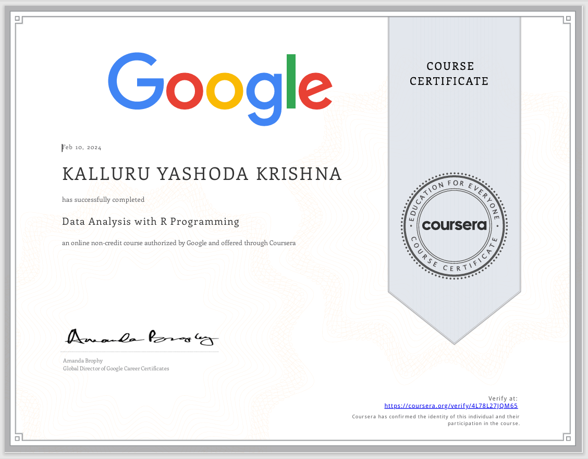

## [C​ourse 7 – Data Analysis with R Programming](https://www.coursera.org/learn/data-analysis-r?specialization=google-data-analytics)

This course is the seventh course in the Google Data Analytics Certificate. These courses will equip you with the skills needed to apply to introductory-level data analyst jobs. In this course, you’ll learn about the programming language known as R. You’ll find out how to use RStudio, the environment that allows you to work with R. This course will also cover the software applications and tools that are unique to R, such as R packages. You’ll discover how R lets you clean, organize, analyze, visualize, and report data in new and more powerful ways.  Current Google data analysts will continue to instruct and provide you with hands-on ways to accomplish common data analyst tasks with the best tools and resources.

&nbsp;

### Course content

* **Understanding the basics of R**: R is a programming language that can be used to perform tasks in every phase of the data analysis process. In this part of the course, you will learn about R and RStudio, an integrated developer environment (IDE) for R. You will explore the benefits of using RStudio to work with R. RStudio enables you to easily leverage the features and functionality of R. 
* **Programming using RStudio**: In this part of the course, you will explore the fundamental concepts associated with R. You will learn about functions and variables that you can use in your calculations and other programming. You will also learn about R packages, which are collections of R functions, code, and sample data that you can use in RStudio.
* **Working with data in R**: The R programming language was designed to work with data at all stages of the data analysis process. In this part of the course, you will examine how R can help you structure, organize, and clean your data through functions and other processes. You will learn about data frames and how to work with them in R. You will also revisit the concept of data bias and how you can use R to address it.
* **Visualizations, aesthetics, and annotations**: R is a great tool for creating detailed visualizations. In this part of the course, you will learn how to use R to generate and troubleshoot visualizations. You will also explore the features of R and RStudio that can help you improve the aesthetics of your visualizations. You will learn how to annotate visualizations and save the changes. 
* **Documentation and reports**: R has a number of different options to explore when you are ready to save and present your analysis. In this part of the course, you will explore R Markdown, a file format for making dynamic documents with R. You will learn how to format and export R Markdown and incorporate R code chunks in your documents.
* **Course challenge**: At the end of the course you will apply everything you have learned in the Course Challenge. The Course Challenge will ask you questions about the key skills you have been practicing and will give you an opportunity to demonstrate those skills in three scenarios.  