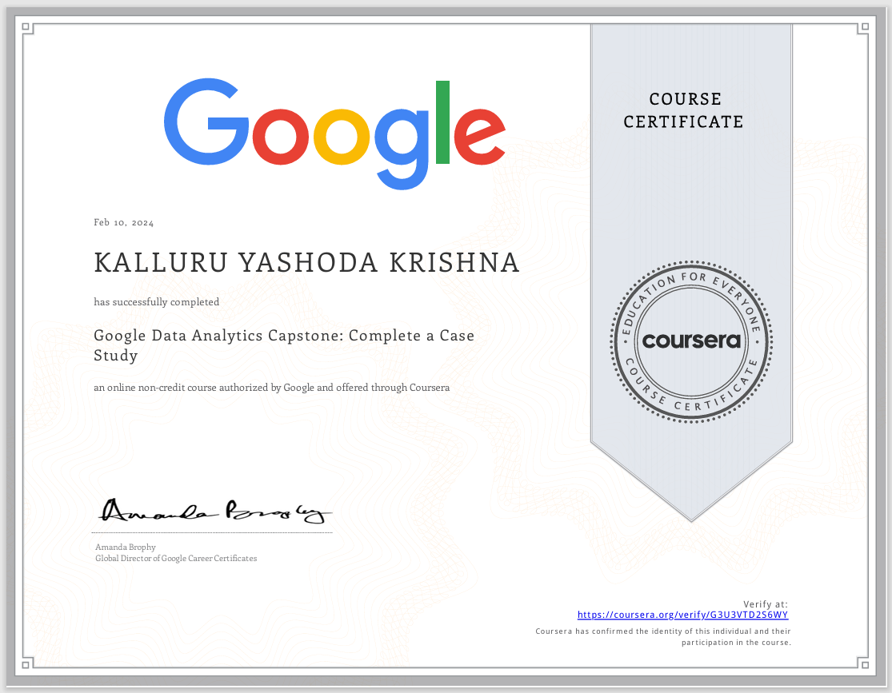

## [C​ourse 8 – Google Data Analytics Capstone: Complete a Case Study](https://www.coursera.org/learn/google-data-analytics-capstone?specialization=google-data-analytics)

This course is the eighth course in the Google Data Analytics Certificate. You’ll have the opportunity to complete an optional case study, which will help prepare you for the data analytics job hunt. Case studies are commonly used by employers to assess analytical skills. For your case study, you’ll choose an analytics-based scenario. You’ll then ask questions, prepare, process, analyze, visualize and act on the data from the scenario. You’ll also learn other useful job hunt skills through videos with common interview questions and responses, helpful materials to build a portfolio online, and more. Current Google data analysts will continue to instruct and provide you with hands-on ways to accomplish common data analyst tasks with the best tools and resources.

&nbsp;

### Course content

* **Capstone basics**: A capstone project in Coursera refers to a final project at the end of a study program. In the real world, these types of projects are more often referred to as case studies, Case studies are common ways for employers to assess the skills of prospective job candidates. In this part of the course, you will explore the benefits of using capstone projects, case studies, and portfolios to showcase your new skills to potential employers.  
* **Building your portfolio**: In this part of the course, you will be introduced to two tracks (and possible cases for you to use) to complete your capstone project. Depending on which track you choose, you will then be directed to specific lessons and instructions that are applicable to the track you selected. The final deliverable in either track is a finished case study for your online portfolio.
* **Using your portfolio**: Having a case study in your portfolio is a first step. In this part of the course, you will focus on how you will use your portfolio to highlight skills that employers are looking for. You will develop an elevator pitch for your case study that enables people to quickly grasp a high-level understanding of what you did. Then, you can practice incorporating aspects of your case study into answers for different types of interview questions. 